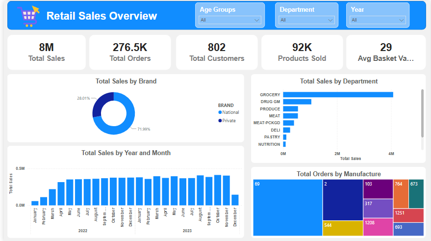

# Retail Sales Overview — Power BI Dashboard

A Power BI dashboard analyzing two years of retail transaction data (2022–2023) across 2,500 households, 92K+ products, and 580+ stores. Built as a guided assignment for ROUTE Academy's Power BI track, using a star-schema data model built entirely in Power Query.



## How to Open

1. Download `Retail_Sales_Overview.pbix` from this repo
2. Open it in [Power BI Desktop](https://www.microsoft.com/en-us/power-platform/products/power-bi/downloads) (free)
3. The full model, relationships, and dashboard load automatically — no setup needed

## The Business Context

The dataset is a household-panel retail transactions log (commonly known as the Dunnhumby "Complete Journey" dataset): individual order lines tied to households, products, and stores, plus optional household demographic survey data.

There's no single "department head" asking a specific question here — this is an exploratory BI exercise. The goal was to take four flat, denormalized CSV exports and turn them into a clean, queryable star schema, then surface the kind of sales, customer, and product insights a retail analytics team would actually want on one screen.

## The Problem

The raw data arrives as four flat files with no defined relationships:
- `order.csv` — order-level metadata (household, store, date, week)
- `order_line.csv` — line-item transactions (product, quantity, sales value)
- `product.csv` — product catalog (department, brand, manufacturer)
- `hh_demographic.csv` — household demographic survey responses

Three specific data issues had to be resolved before any reliable reporting was possible:
1. **No real calendar dates** — orders only carry a sequential `DAY` number (1–711), not an actual date.
2. **Incomplete demographic coverage** — only 801 of the 2,500 households in the order data have a matching demographic survey response; the other 1,699 are "non-panel" shoppers with no profile.
3. **No geography anywhere** — neither stores nor households carry a city, state, or country field, which rules out a literal map visual without sourcing outside data.

## What Was Built

**Data modeling (Power Query):**
- Split the flat data into one fact table and four dimension tables, following a star schema
- Generated a `Dim_Date` table from scratch (the source data had no real dates to reference)
- Deduplicated `Dim_Product`, `Dim_Customer`, and `Dim_Store` on their key columns
- Added an explicit "Unknown" row to `Dim_Customer` (key = -1) to capture the 1,699 non-panel households, instead of letting them silently drop out of demographic-sliced visuals
- Verified zero orphan keys between `Fact_Sales` and every dimension table

**Final model:**

| Table | Type | Grain |
|---|---|---|
| Fact_Sales | Fact | One row per order line (2,595,732 rows) |
| Dim_Date | Dimension | One row per calendar day |
| Dim_Product | Dimension | One row per PRODUCT_ID |
| Dim_Customer | Dimension | One row per household_key |
| Dim_Store | Dimension | One row per STORE_ID |

**DAX measures:**
```dax
Total Sales = SUM(Fact_Sales[SALES_VALUE])
Total Orders = DISTINCTCOUNT(Fact_Sales[ORDER_ID])
Total Customers = DISTINCTCOUNT(Fact_Sales[household_key])
Avg Basket Value = DIVIDE([Total Sales], [Total Orders])
```

**Dashboard visuals:**
- KPI card strip — Total Sales, Total Orders, Total Customers, Products Sold, Avg Basket Value
- Column chart — Total Sales by Year and Month
- Bar chart — Total Sales by Department
- Donut chart — Total Sales by Brand (National vs. Private label)
- Treemap — Total Orders by Manufacturer (substituted for the brief's required Map Chart, since no geographic field exists in the source data)
- Slicers — Age Group, Department, Year

## Key Insights

- **$8.01M** in total sales across **276,484 orders** from **802 distinct customers**, averaging **$28.98 per basket**.
- **Grocery dominates the department mix** at roughly $4.08M — more than 4x the next category (Drug GM at ~$1.05M).
- **National brands outsell private label by a wide margin**: 71.99% vs. 28.01% of total sales.
- **Sales ramped up steadily through 2022** (from ~$58K in January to ~$370K by year-end) as more households were onboarded into the panel, then plateaued around $370–410K/month through 2023.
- **Customer purchase behavior data is incomplete by design**: only 801 of 2,500 households in the raw order data have a demographic profile on file. This was handled transparently (an explicit "Unknown" segment) rather than dropped or guessed at.
- **Order volume is concentrated in a small group of top manufacturers** — the largest manufacturer alone accounts for over 193K of the 276K total orders, suggesting heavy reliance on a few key suppliers.

## Recommendations

1. **Investigate the demographic data gap.** With 68% of households lacking survey data, any future customer-segmentation or marketing-targeting work will be working with a minority, non-representative sample. Closing this gap (via loyalty sign-up incentives, in-store surveys) would substantially improve targeting accuracy.
2. **Evaluate private-label growth opportunity.** At 28% of sales, private label has room to grow relative to typical grocery retail benchmarks. A category-level review of where national brands are winning could reveal substitution opportunities.
3. **Reduce concentration risk in top manufacturers.** With the top supplier tied to ~70% of total order volume on its own, supply chain or pricing disruptions from that single manufacturer carry outsized risk. Diversifying SKU sourcing in high-volume departments (Grocery, Drug GM) is worth a deeper look.
4. **Treat the early-2022 sales ramp as a panel-size effect, not a demand signal.** Since the ramp lines up with new households joining the panel, it shouldn't be read as organic month-over-month growth when forecasting.
5. **Source a store-location lookup table if geographic reporting becomes a requirement.** The current data has no city/state/country field, so any future request for store-level geographic visualization will need this added externally.

## Tools Used

- Power Query (M) — data transformation and star schema modeling
- Power BI Desktop — data modeling, DAX measures, dashboard design
- DAX — KPI and aggregation measures

## Files

- `Retail_Sales_Overview.pbix` — the finished Power BI file: full data model, relationships, DAX measures, and the dashboard report. Open directly in Power BI Desktop.
- `screenshots/dashboard_overview.png` — dashboard screenshot
- The raw star-schema workbook (`Retail_Dataset.xlsx`) is intentionally not included in this repo — it's ~138MB, over GitHub's 100MB file limit, and isn't needed anyway since the `.pbix` already contains the fully built model with all data loaded in.

## Data Source

[Dunnhumby "The Complete Journey" dataset](https://www.dunnhumby.com/source-files/) — household-level transactional data across a 2-year panel.

---

*Built by Ahmed Elsayed as part of the ROUTE Academy Power BI track.*
